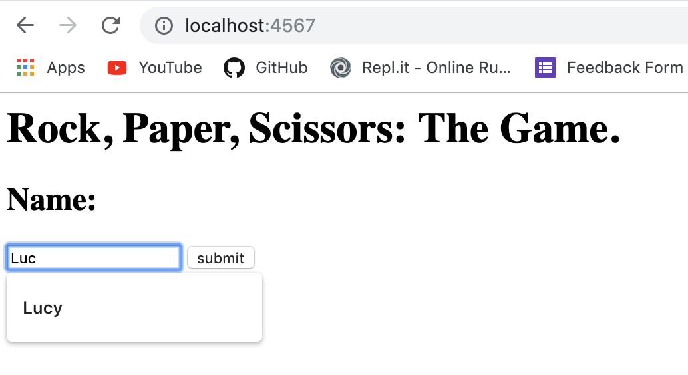
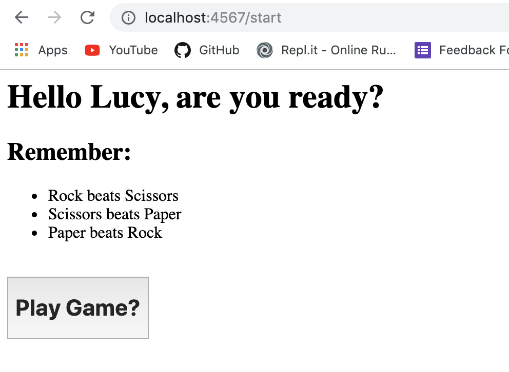
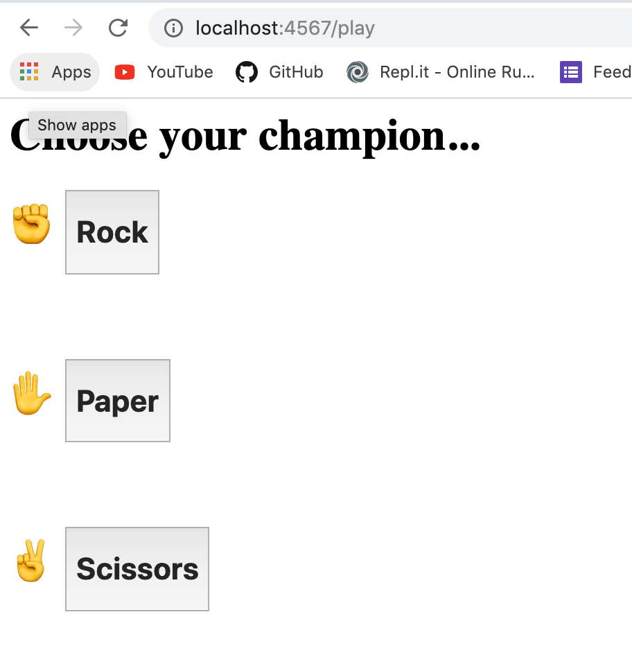
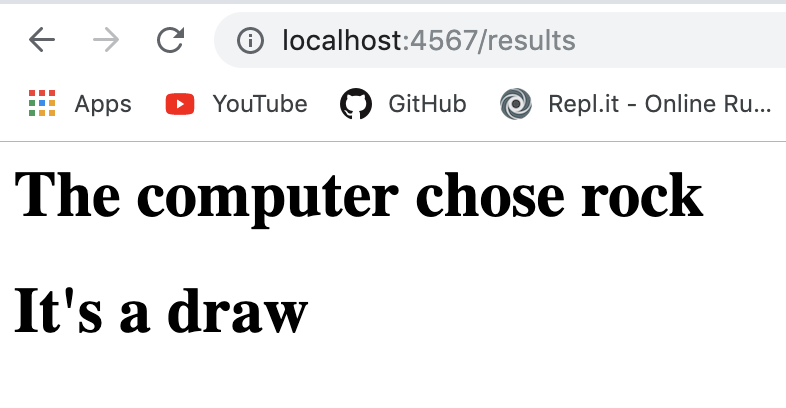
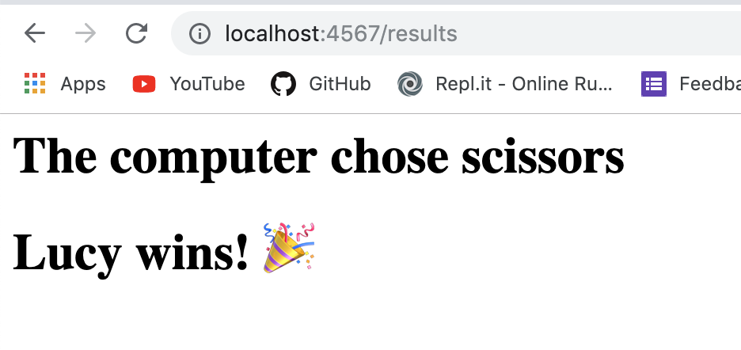

# README_Rock, Paper, Scissors Challenge

## Desired Functionality

- the marketeer should be able to enter their name before the game
- the marketeer will be presented the choices (rock, paper and scissors)
- the marketeer can choose one option
- the game will choose a random option
- a winner will be declared

## Notes on model structure

- The model has two classes:
  - a player class which have name and choice attributes
  - a game class which can ascertain the winner based on the two player's choices

## Future Changes
- I would make a multiplayer version of this game
  - although I have not done this, as my computer is an instance of the player class which simply takes the default arguments for the choose method `(@list.sample)` and the default name passed in on initialization `the computer`, I think that only the following changes would have to be made:
    - add a second button on the index name for them to enter their name
    - pass `param[:player_2_name]` into a new instance of the player class
    - make an erb page when player 2 gets to choose between rock, paper and scissors
    - pass `param[:player_2_choice]` into `player_2.choose()`
- Implement further game options like 'Lizard' and 'Spock'
  - e.g.
    - Scissors beats Paper and Lizard
    - Paper beats Rock and Spock
    - Rock beats Lizard and Scissors
    - Lizard beats Spock and Paper
    - Spock beats Scissors and Rock
  - having one choice beat multiple other ones would not be a problem with my code.

  ```
  def winning_scenarios
    {"rock" => "scissors",
     "scissors" => "paper",
     "paper" => "rock"
    }
  end

  def first_beats_second?
    winning_scenarios[@player_1.choice].include?(@player_2.choice)
  end
  ```
  - I would just change the values in the winning_scenarios hash to an array of options.
- I would like to make the name field on the index page a required field so someone cannot submit an empty name, I have done some research and I think it would work if I did the following...

  ```
  <form action="/" method="post">
    <label for='Name'> <h2> Name:</h2> </label>
    <input type='text', name='name' required>
    <button type='submit', value="submit">submit</button>
  </form>
```


## An example user interaction:
-------
1) The user runs the app in the terminal...


2) The user enters their name, and clicks submit...



3) The user is asked if they want to play the game...



4) The user chooses between Rock, Paper and Scissors...



5) The user has their choice confirmed, and can now find out what the computer chose...


6) The computer's choice is randomly assigned, and the result of the game is printed, here are the three variations of the results screens:

If both the player and the computer have the same choice...



If the computer's choice beats the players...


If the player's choice beats the computers...


